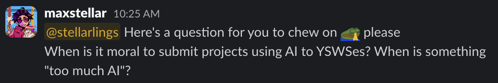
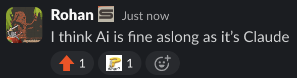
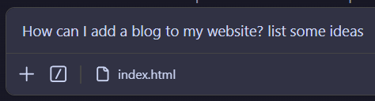
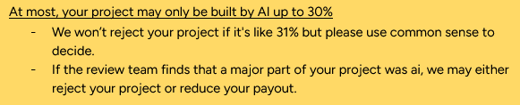
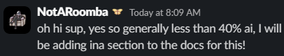
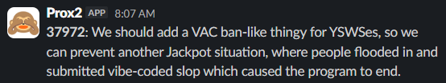

Recently, I was a reviewer for a Hack Club program called [Jackpot](https://jackpot.hackclub.com/). The program itself was incredibly cool, and hats off to Emma for putting so much work into organizing it, but the reviews were... depressing. Emma herself said [in a Slack message](https://hackclub.slack.com/archives/C0ADEGZL5HD/p1775945588784089):

> [A]round 80% of the reviews, was spent rejecting entire projects due to clear, full use of AI without minimal human contribution. Many of the submitted websites look almost identical, heavily vibe-coded, and in some cases include scripts designed to automatically track or generate hours.

I remember getting in a call with @owais and going through reviews, only for us to send every other project to each other, asking "is this AI again?" The worst part is that this isn't even an issue unique to Jackpot. It's also known that Flavortown faces issues with AI slop as well, to the point where Hack Clubbers joke about it quite often on the Slack. The AI issue has been getting progressively more prominent as time goes on, and it's worth a think over.

This isn't to say there are no good projects coming to YSWSes anymore. In fact, it's quite the opposite. During my time reviewing for Hack Club: The Game and Jackpot, I saw so many creative, high-effort, and amazing projects submitted, and it truly made me incredibly proud of our community (if not a little bit disappointed in myself for being so unaccomplished). But it's also true that a lot of slop is being submitted, and some of it even makes it past our review process. So, what can we do to reduce this?

## what is AI slop?

To address AI slop, we must first define what it is. Originally, this blog post was meant to do that: figure out what counts as too much AI usage and what is not. I put out a question in my personal channel [#maxs-cozy-planet](https://hackclub.enterprise.slack.com/archives/C0AL1T3CZ2S) on Slack, which sparked an extremely active thread of discussion, some of which was extremely funny, but ultimately went nowhere. We failed to arrive at any consensus.

I'll briefly sum up what little conclusions I was able to arrive at:

1. There are many different viewpoints on what is justified when it comes to AI usage.
2. My personal viewpoint is that AI code is no longer submittable when you can't understand your codebase to the point that you cannot change or fix it without relying on AI. (ib: @fireentity)
3. What defines something as "your project" vs. "AI's project" is very wishy-washy. Percentages don't work--it's almost impossible to get an accurate percentage of AI usage.

Using this, let's together arrive at a definition for what "AI slop" is:

> A low-effort, low-quality project made primarily using AI, usually to the point where AI usage is apparent without looking at its code.

This is nowhere **near** a perfect definition of what defines AI slop; the term is honestly very subjective. For the purposes of this blog post, let's use mine for now.

## why is AI slop so prevalent now?

It probably has to do with how big Hack Club is getting. It's not the whole cause, of course, but it would make sense. Hack Club is built on hackers -- people who build because they want to build, create because they want to create. As we expand, we gain more of a second type of Hack Clubber: the ones who join simply for prizes and rewards.

This isn't necessarily bad. The truth is, a lot of the hackers mentioned earlier (build because they want to build) started out as this second type of Hack Clubber. I joined looking for free stuff, and gradually fell in love with coding for the sake of coding and making for the sake of making.

But this isn't the case for all type 2 Hack Clubbers. Some are just looking to get prizes + get out. That's perfectly valid--but it's the methods you employ to achieve such ends that get you put into AI slop timeout corner.

The truth is, the fastest way to make working projects is to yell at Claude until it spits out something savory. Oh what the hack, even I'm guilty of this. The code for this blog was mostly vibecoded too, since I was too lazy to actually go and read documentation and watch tutorials on how to make one. I'd like to justify it to myself, saying that I learnt it from the AI or by reading the AI's code, but it certainly doesn't beat actually learning how to make it myself, and then making it myself. If you asked me to replicate it right now... I probably couldn't!

What this means for us is: we're getting lots of people who are joining for prizes and prizes alone, and we're growing into an age where it's extremely easy to generate the projects needed to earn the prizes. Put two and two together... the fastest and easiest way to get prizes is to AI generate projects, and so, instead of learning, building, making, creating... people are AI slopping.

I don't want to make you think that "ohhhh, everyone is just out to fraud hours and make slop to get prizes!" Truthfully, a good amount of people may not even realize that they have made AI slop; we could do a better job of preventing AI slop from happening in the first place.

### Sidebar - why did Jackpot receive so much more slop?

Jackpot was an extremely generous program (which is great) in that its hourly rate ($6/hr) was extremely high versus other Hack Club programs, as well as the fact that the Jackpot IRL event was free to attend (no hours needed for an invite). However, I think this ultimately bit the program in the back: the direct translation of hours to money, the event being free to attend -> shipping solely being for prizes, and the prizes having near equal values around the board regardless of hacker value translated to the program feeling sort of like a job, even.

This section isn't meant to criticize Jackpot, but moreso analyze exactly why this amazing, generous, and creative program faced the issues that it did. The truth is that working with Emma and everyone else on the Jackpot was such a fun time, and I'm extremely grateful they invited me to help review. I'm so excited for what she and her team will do next.

Okay. Whew. That was a lot. Sorry. I've been doing a whole Latta yapping, and not a whole Latta giving suggestions--so, let's talk solutions, roughly from easiest to hardest to implement.

## clearer AI guidelines

Some programs seem to have some arbitrary percentage limit in terms of AI usage. Off the top of my head, HCTG lists a 30% AI limit and Macondo has a 40% limit.

In theory, these are good ways to filter through AI slop, but in practice, <u>percentages do not work.</u> There's no way to detect how much code was AI and how much wasn't. At the end of the day, these random numbers are just a nothing burger. As a reviewer, I look at a project and I try to gauge whether human effort was put into the project. I try to gauge if AI was used for small, minor tasks, or if it was used to generate the main functionality of the project. I try to gauge if the user has gone "uhhhh claude make me a website," or sat there meticulously thinking of things to add, writing out to Claude exactly what they want and how they want Claude to implement it.

The solution is to detail these exactly. What are reviewers looking for? How should we (particpants) be using AI? How shouldn't we be?

> ❌ "Yeah, keep it under x%"
>
> ✅ "Only use AI for mundane tasks! Make sure you still understand your code! Put effort into making it look human-made!"

In fact, I'll do you one better - here's a general modifiable template that YSWSes can use for a clearer and more tangible AI guideline.

> Excessive AI usage is **NOT** allowed. When reviewing projects, we look for genuine human effort in both the final product and the thought behind it. There is a difference between someone who typed "make me a website" and someone who carefully considered what to build, made deliberate decisions, and used AI to help execute specific parts.
>
> You are allowed to use AI in minor and supporting ways such as:
>
> - small improvements and touch-ups
> - simple, repetitive tasks that would be tedious by hand
> - cleaning up messy code (just commit first so there's a record of your code before AI touched it!)
>
> A good rule of thumb: could a reviewer still see your personality on the project if AI were removed? If the core of your project (functionality, structure, style, etc) were all AI-generated, it won't pass review.

This eliminates the issue of vague nothing burger, clearly defining what is okay and what would get rejected. YSWS organizers, reviewers, others, feel free to add or remove bullet points as you see fit, reword the lead-in and conclusion, add more. This is completely free for you to use or take inspiration from.

Also, how do we as reviewers uphold a common standard of what counts as AI slop? Rubric!

> **Metagame:** All / lot of the code in a single, initial commit? AI-sounding comments? Placeholder tokens, data, or statistics?
>
> **Common AI Patterns:** Unnatural shoehorning of emojis, gradients? Overuse of "Badges" or "pills"? Common AI animations? Content hallucinations?
>
> **Code:** Overly verbose variable names? Excessive error handling / edge cases no one but an AI would think of?

Note that this rubric is not exhaustive and is meant for use as a tool. It's not designed to evaluate projects perfectly, it's meant to help you with common signs of AI usage--the final determination and review of a project should still be up to you.

## intentional YSWS design

No, this is not the aggressive rethinking of the weighted grant model you've been hoping for. Many a smarter person than I have tried and failed to tackle the WG/WP system, and as such I will not be attempting to do so today.

The answer to AI slop is to make it impossible to make AI slop per your constraints on the program or rules for submission. This solution will not work for a good amount of YSWSes (most likely the larger ones, which is a bit counterintuitive since they are the ones facing the most AI slop in the first place), but for smaller YSWSes, this will work like a charm. Here's how:

**1. Add an interesting constraint to your YSWS**

For [#onekey](https://onekey.dino.icu/), I'm challenging people to build projects that only use one key as input. Others that fit this model include [#saycheese](https://saycheese.hackclub.com/) and #shrink by @Anson Chung.

These sorts of constraints are difficult to slop - they at the very least require the prompter to sit there and think about the project and be creative with it, toeing the line between responsible and irresponsible AI usage. You can't just sit there and say "make me a website, make no mistakes" and watch as Claude works away at another B2B SaaS concept website.

**2. Submission prompts**

Ask questions that require reflection, such as: "What were some challenges you faced? What was the hardest part? What was your favorite part?"

It won't perfectly filter out AI slop, and it won't prevent it from being submitted, but it will give reviewers somewhat of an immediate BS detector.

**If these were implemented...**

...our programs could be better suited to deter AI slop and incentivize what we want submitted--high quality projects that promote learning and building and growing. We would also have more interesting YSWSes to participate in, and more content to look at (namely, reflections might be interesting for something like [the Hack Club Magazine](https://magazine.hackclub.com/)).

## VAC bans

The time for blaming ourselves is over. At some point, people begin to know what they are doing when they slop. It is intentional. Calculated.

The idea is simple: Hackatime ban or ban-adjacent system for those who have submitted AI slop more than once.

Pros:

- Infra is already there with the fraud ban system
- Would greatly reduce the amount of AI slop submitted by repeat offenders
- Gives reviewers a central authority to back them up when submitters argue about their rejections/bans

Cons:

- "AI slop" is subjective and may change from program to program
- False bans are much heavier + permanent-feeling than rejections
- Might alienate legitimate learners who are just figuring things out, testing the waters

I think the tradeoffs are worth it, and with some workshopping, the cons can be ironed out. Implementation of some sort of system, whether it's a literal Hackatime ban or some sort of system flagging offenders on the reviewer end, would stop sloppers from taking up valuable reviewer bandwidth ~~and to keep reviewer faith in humanity.~~

## conclusion

The point I'm trying to make is... AI slop is a big issue for Hack Club. Whether you're a Hack Clubber browsing Flavortown's explore page and observing the amount of vibecoded projects, or a reviewer rejecting your 5th vibecoded project in the same hour, or a program organizer getting fined for letting slop enter the unified DB... it's not just my problem, not just your problem, not just HQ's problem, but it's a problem for all of us.

This isn't a simple problem to address. The line between responsible AI use and lazy vibecode is blurry, and all of us--participants, reviewers, organizers--will get it wrong sometimes. With Hack Club growing the way it is, and [Stardance](https://stardance.hackclub.com/) right around the corner poised to attract thousands if not tens of thousands of new Hack Clubbers, it's important to acknowledge that we will never be completely free of AI slop. But if we can build a community that genuinely cares, with programs that set clear expectations, ideas that make real building worth it, and systems that stop bad actors from gaming the whole thing... maybe we can make sure that what all of us have grown to love about Hack Club--the way it turns prize-hungry kids into passionate, inspired builders--wins out over AI slop.
